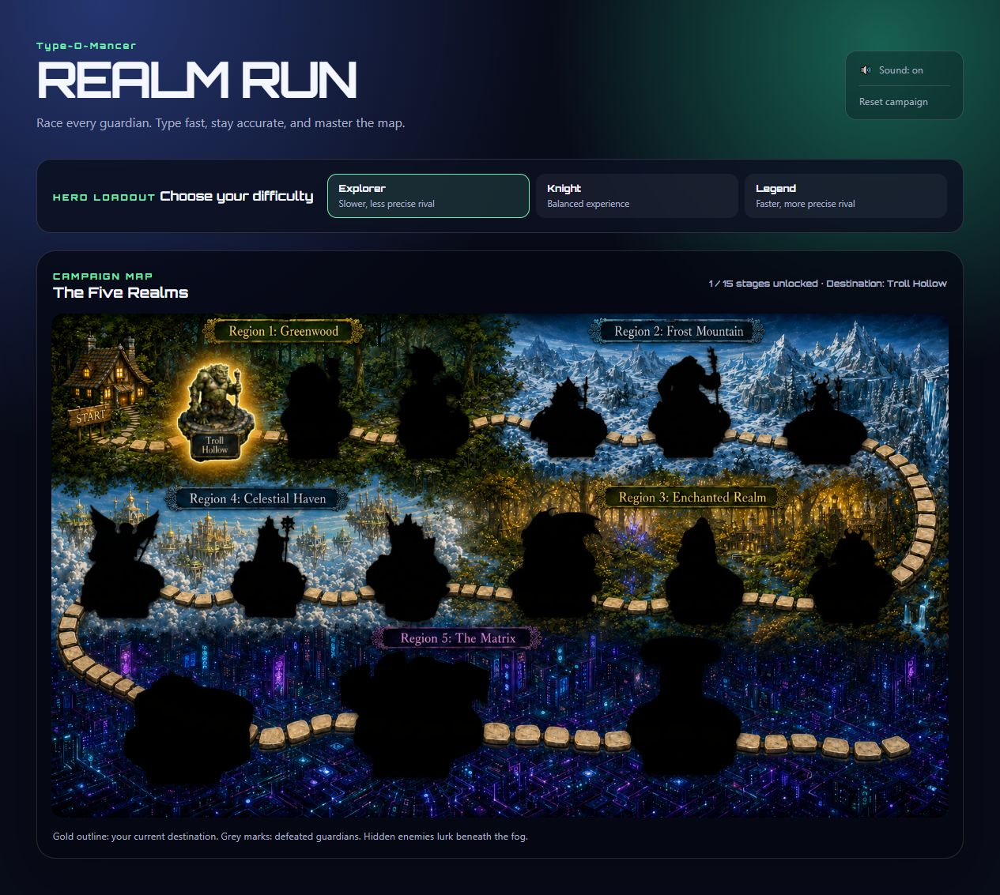
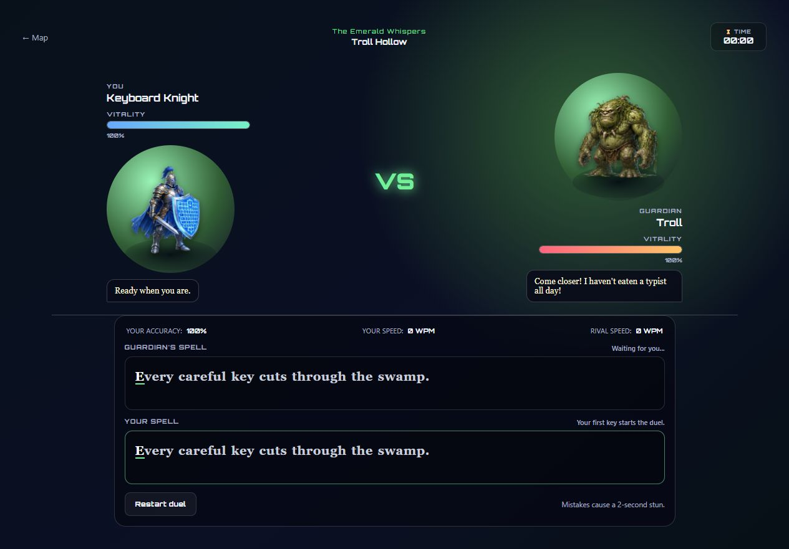
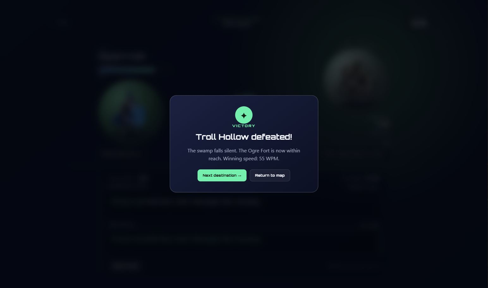

# Type-O-Mancer: Realm Run

**A fantasy typing game where every correct keystroke is an attack.**

[**Play the live game on GitHub Pages →**](https://petervin.github.io/Type-O-Mancer/)

Type-O-Mancer turns a familiar typing test into a small RPG campaign. Instead of racing a timer on an empty screen, the player travels through five distinct realms and challenges their guardians in real-time typing duels. Accuracy matters just as much as speed: one wrong key leaves the player stunned for two seconds and gives the rival a chance to catch up.

I built this as a portfolio project to explore how far I could take a browser game with plain HTML, CSS and JavaScript. There is no framework, backend or build step. The campaign data, map rendering and game logic are kept separate, while progress is stored locally in the browser.

## Screenshots

### Campaign map



### Typing duel



### Victory screen



## The idea

Most typing games are useful, but visually quite dry. I wanted to keep the clear feedback of a typing trainer while giving every run a sense of place and progression. In Type-O-Mancer, completed sentences deal damage, mistakes have an immediate consequence, and every victory reveals another destination on the world map.

The result is a short, replayable campaign that mixes typing practice with the pacing and presentation of a fantasy duel.

## Features

- 15 encounters across five themed regions
- Three difficulty levels: Explorer, Knight and Legend
- A computer-controlled rival with stage-based speed and error rates
- Live WPM, accuracy, health and elapsed-time tracking
- Two-second stun penalty for incorrect keystrokes
- Character dialogue for encounters, mistakes and recovery
- Persistent campaign progress and best WPM scores using `localStorage`
- Locked, active and completed locations shown directly on the campaign map
- Region-specific colors, typography and atmosphere
- Keyboard, victory and defeat sound effects with a sound toggle
- Restart, return-to-map and full campaign reset controls
- Responsive layout and semantic labels for the main interactive elements
- No dependencies, network requests or account required

## How the game works

The campaign starts at Troll Hollow. Choosing the highlighted location opens a duel and randomly selects one of that guardian's challenge texts. The timer and opponent only start moving after the player's first keypress.

Each correct character advances the player's spell and reduces the guardian's vitality. A wrong character does not move the cursor forward; instead, it briefly marks the error and stuns the player for two seconds. The computer opponent follows the same sentence at a simulated WPM, occasionally makes a mistake, and then pauses to recover.

The first side to finish the text wins. Winning unlocks the next location, stores the best WPM result for the completed stage and updates the map. After all 15 guardians are defeated, the campaign displays its final victory state.

### Difficulty model

Difficulty changes more than a label. It adjusts the rival's typing speed and chance of making a mistake. Later stages also become progressively faster, while opponents recover from their mistakes more quickly in each new realm.

| Difficulty | Rival speed | Rival accuracy |
| ---------- | ----------- | -------------- |
| Explorer   | Slower      | Lower          |
| Knight     | Balanced    | Balanced       |
| Legend     | Faster      | More precise   |

The displayed WPM uses the common five-characters-per-word convention:

```text
WPM = (correct characters / 5) / elapsed minutes
```

## Technology

| Area        | Used in the project                                                                    |
| ----------- | -------------------------------------------------------------------------------------- |
| Structure   | Semantic HTML5                                                                         |
| Styling     | CSS custom properties, Grid, Flexbox, responsive media queries and keyframe animations |
| Game logic  | Vanilla JavaScript                                                                     |
| Persistence | Web Storage API (`localStorage`)                                                       |
| Sound       | HTML Audio API                                                                         |
| Artwork     | PNG map, locations and character sprites                                               |
| Typography  | Locally bundled Orbitron variable font                                                 |

Keeping the project dependency-free was a deliberate constraint. It made me focus on browser fundamentals and on organizing state and rendering without hiding the mechanics behind a framework.

## Project structure

```text
Type-O-Mancer/
├── index.html                 # Map, battle screen and modal markup
├── js/
│   ├── campaign-data.js       # Realms, stages, dialogue, difficulty and asset data
│   ├── map-renderer.js        # Campaign map nodes and their visual states
│   └── app.js                 # Game state, input, opponent, scoring, audio and storage
├── styles/
│   ├── base.css               # Global layout, typography and shared components
│   └── game.css               # Sprites, map states and game-specific effects
├── assets/
│   ├── characters/            # Player and guardian artwork
│   ├── sites/                 # Map location artwork
│   └── world-map/             # Campaign background
├── audio/                     # Typing and result sound effects
├── fonts/                     # Local Orbitron font and license
└── docs/screenshots/          # Images used by this README
```

The JavaScript is split into three small responsibilities rather than one large script:

1. `campaign-data.js` describes the content of the game.
2. `map-renderer.js` turns campaign progress into map elements.
3. `app.js` owns the active duel and connects input, timing, scoring, audio and persistence.

Classic scripts expose only the small shared objects needed by the next file, so the game can run without bundling or module resolution.

## Run it locally

The quickest way to try the game is the [live GitHub Pages version](https://petervin.github.io/Type-O-Mancer/). No account or installation is required.

To run your own local copy:

1. Clone the repository:

   ```bash
   git clone https://github.com/PeterVin/Type-O-Mancer.git
   ```

2. Open the project folder:

   ```bash
   cd Type-O-Mancer
   ```

3. Open `index.html` in a modern browser.

You can also serve the folder with any static file server if you prefer working through `localhost`.

## What I learned

This project gave me a much better feel for the small timing and state-management details that make an interactive experience feel responsive.

- **Designing around state:** the map, active battle, result modal, unlocked stages and saved scores all need to stay in sync. Separating persistent campaign state from short-lived battle state made that manageable.
- **Turning a formula into game feedback:** WPM and accuracy are simple calculations, but connecting them to health bars, character progress and win conditions made the numbers feel meaningful.
- **Building a believable opponent:** a fixed timer felt mechanical. Giving the rival a target WPM, small timing variation, an error rate and recovery pauses made the race much less predictable.
- **Handling keyboard input precisely:** the game needs to ignore modifier keys, prevent unwanted text editing, preserve focus and give immediate feedback without letting incorrect input advance the player.
- **Keeping UI feedback consistent:** current, correct and incorrect characters, stun animations, dialogue, sound and health all describe the same event. Updating them together was important for making mistakes and victories easy to understand.
- **Using data instead of repeated markup:** defining stages, dialogue and map coordinates as data made it possible to add 15 encounters without duplicating the battle UI.
- **Working without a framework:** manually rendering only the changing parts of the DOM was a useful reminder that small applications can stay readable and capable without extra dependencies.
- **Thinking about persistence defensively:** saved JSON can be missing or malformed, so the loading logic validates it and falls back safely instead of breaking the campaign.

## Possible next steps

There is still plenty of room to expand the idea. The additions I would explore next are selectable challenge lengths, personal statistics over time, keyboard-only map navigation, additional accessibility preferences and a daily challenge mode.

## Assets and credits

- The project uses the **Orbitron** typeface, distributed under the SIL Open Font License. The license file is included in [`fonts/OFL.txt`](fonts/OFL.txt).
- Sound effects are from **Mixkit** under the Mixkit Sound Effects Free License. See [`audio/LICENSES.md`](audio/LICENSES.md).
- Game artwork is bundled locally in the `assets` directory.

---

Built as a personal project around a simple question: what if typing practice felt like a boss fight?
